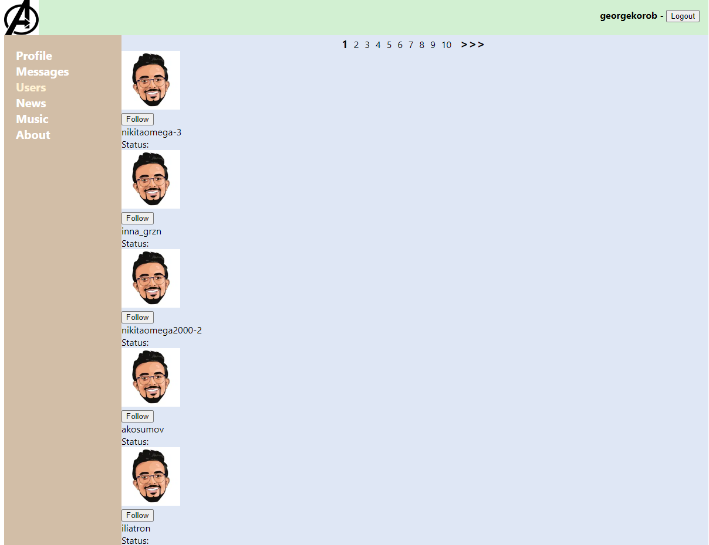

# React App (Redux)

SPA приложение на React, в нем используются современные технологии для разработки web приложений. 
Это незаконченный проект социальной сети, в котором можно просматривать список пользователей, 
писать сообщения и посты, просматривать профиль.

## Технологии
1. JavaScript
2. React
3. Redux
4. HTML CSS

### Профиль и посты

### Список сообщений

### Список пользователей
